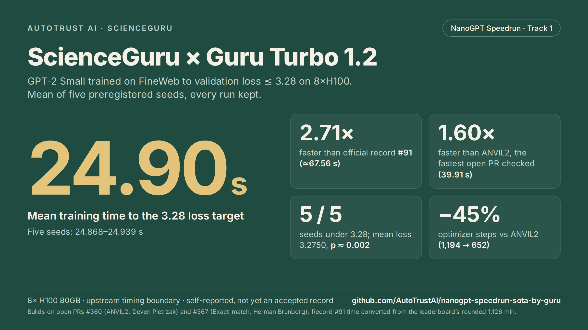
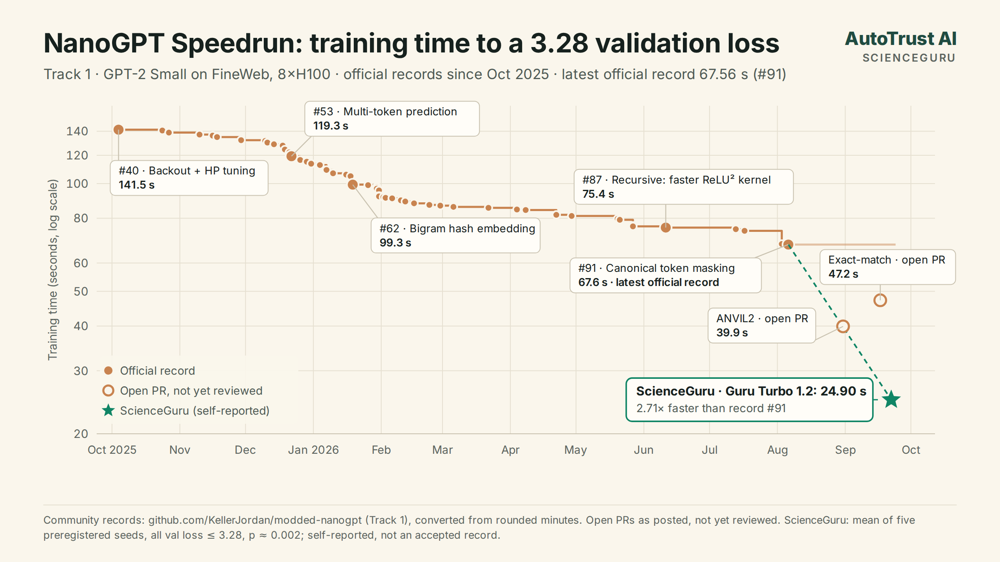
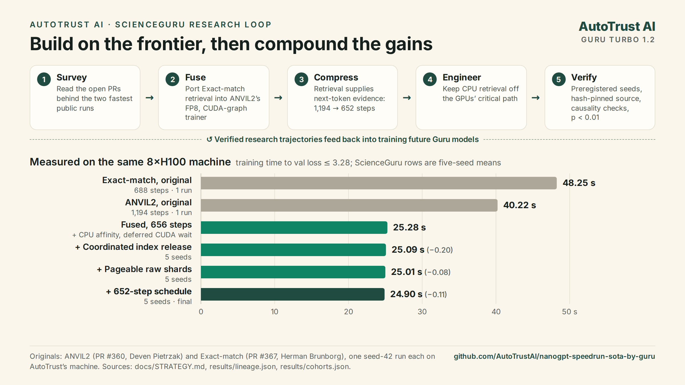

**AUTOTRUST AI  ·  SCIENCEGURU  ·  RESEARCH**

# New Record: ScienceGuru Cuts the NanoGPT Speedrun to 24.9 Seconds

Running Guru Turbo 1.2, AutoTrust’s research platform trained GPT-2 Small to the 3.28 validation-loss target in 24.90 seconds on eight H100s: 2.71× faster than the current official record.

September 25, 2026  ·  ScienceGuru  ·  Guru Turbo 1.2  ·  NanoGPT Speedrun

Today we are releasing ScienceGuru’s result on the NanoGPT Speedrun, the open benchmark that asks how quickly a GPT-2-sized model can be trained to a fixed quality bar. Running Guru Turbo 1.2, ScienceGuru trained the model to a mean validation loss of 3.2750 in a mean of 24.90 seconds on eight H100 GPUs, across five preregistered seeds with every run kept.

That is 2.71× faster than the current official record, Canonical Token Masking (#91, about 67.56 seconds), and 1.60× faster than ANVIL2 (39.91 seconds), the fastest open submission we checked. The code, logs, source hashes and a verification script are open at [github.com/AutoTrustAI/nanogpt-speedrun-sota-by-guru](https://github.com/AutoTrustAI/nanogpt-speedrun-sota-by-guru).



*Five-seed mean on 8×H100. The result is self-reported and is not yet an accepted leaderboard record.*

## Why the NanoGPT Speed run

The speedrun fixes the data, the hardware and the target, a FineWeb validation loss of 3.28 or lower on one 8×H100 node, and measures only training time. Any gain has to hold up on a codebase the community has optimized for more than two years: 91 official records have taken training from 45 minutes to about 67.6 seconds, through changes to optimizers, architecture, numerical precision, kernels, communication and data loading.

That makes it a demanding test for automated research. In June, [Recursive reported](https://www.recursive.com/articles/first-steps-toward-automated-ai-research) a 77.5-second solution from its automated research system, and its faster ReLU² kernel became official record #87.



*Official Track 1 records since October 2025, two open submissions and ScienceGuru’s five-seed mean, on a log scale. Official times are converted from the leaderboard’s rounded minutes.*

## What ScienceGuru changed

The result did not come from one trick. ScienceGuru started where the frontier was, with the two fastest public submissions, both still open pull requests. It fused them, used the fused model to cut the training schedule nearly in half, then reworked the host-side systems that decide whether eight GPUs are ever left waiting. The speedrun’s rules explicitly encourage building on open pull requests, and both authors are credited in the repository.

### 1. Fusing two open submissions

[ANVIL2](https://github.com/KellerJordan/modded-nanogpt/pull/360), by Deven Pietrzak, is a fast training system: sampled-softmax training, an 84.6-million-row hashed n-gram embedding table, the ANVIL optimizer, FP8 across the stack, mixed-width attention, and a training step captured as CUDA graphs. [Exact-match](https://github.com/KellerJordan/modded-nanogpt/pull/367), by Herman Brunborg, adds a different kind of memory: a CPU index of the training data that finds the longest earlier match of the current context and gives the model the tokens that followed it, as learned vectors added at the input, middle and output of the network.

The two do not compose out of the box. ANVIL2’s CUDA graphs replay fixed memory addresses, while Exact-match produces data-dependent matches on a CPU thread. ScienceGuru gave retrieval a fixed shape, a match length and four candidate tokens per position, wired it into ANVIL2’s captured graphs, and warmed the graphs up on synthetic “match” and “no match” inputs so that both paths are captured before the clock starts. It also registered the retrieval parameters with ANVIL2’s optimizer, moved the middle injection point ahead of the layer ANVIL2 skips, and kept retrieval on true document boundaries, taken before ANVIL2 splits sequences for attention.

**TECHNICAL DETAIL**

#### Retrieval inside a captured training step

Exact-match’s three injection sites, as placed in ANVIL2’s forward pass (excerpt from model/train_gpt.py):

```python
x = self.embed(input_seq)
x = x + self.ret_site_scale_in.type_as(x) * ret_r            # input
...
# ANVIL skips layer 7; inject before that branch and its cache[7] write.
if i == 7:
    x = x + self.ret_site_scale_mid.type_as(x) * ret_r[None]  # middle
...
x = x + self.ret_site_scale_out.type_as(x) * ret_r[None]      # output
x = norm(x)
```

The untimed warmup alternates synthetic “match” and “no match” inputs, so the CUDA graphs capture both paths; model and optimizer state are restored before the clock starts:

```python
# Alternate absent/present synthetic matches; all learned state is restored below.
_warm_ret = (torch.full_like(inputs, 8 if step % 2 else 0, dtype=torch.int64),
             (inputs.long()[:, None].expand(-1, 4).contiguous() if step % 2 else
              torch.full((inputs.numel(), 4), -1, dtype=torch.int64, device=device)))
_CG.fwd(step, inputs, targets, cum_seqlens, _bg_fwd, _warm_ret)
```

### 2. Cutting the schedule nearly in half

With retrieval supplying next-token evidence from the first step, the fused model reaches the target much sooner. ScienceGuru rescaled the full training schedule from ANVIL2’s 1,194 steps to 656, then 652, keeping the stage structure intact. The final schedule trains the network on 180.9 million tokens. As in Exact-match, the retrieval index itself is built from all 103 FineWeb training shards, inside the timed interval.

### 3. Keeping the GPUs fed

Retrieval runs on the CPU, so the last gains came from systems work:

- NUMA-aware placement. Each GPU’s process runs on 13 physical cores of its own socket, set before PyTorch starts its worker pools.

- Deferred CUDA waits. A prefetched batch carries its readiness event, and the training step waits on it only at first use.

- Bounded asynchronous copies. Larger pinned buffers and a cap on in-flight copies let retrieval results stream to the GPUs without stalling the loader.

- Coordinated index release. Every rank confirms its queries are done before any rank frees its index.

- Pageable raw shards. Large CPU shards are no longer pinned whole; only the per-batch buffers that feed the GPUs are.

Measured on the same machine, these steps moved the five-seed mean from 25.28 to 25.01 seconds, and the 652-step schedule brought it to 24.90.

**TECHNICAL DETAIL**

#### Deferring the CUDA wait

The prefetch thread records an event once a batch’s copies are issued. The training loop waits on it only when the batch is first used on the GPU, instead of making earlier work wait on a future batch (model/retrieval.py):

```python
def wait_for_batch(batch):
    """Transfer a prefetched batch's CUDA ownership at its first real consumer."""
    ready = batch[8]
    if ready is not None:
        consumer_stream = torch.cuda.current_stream(batch[0].device)
        consumer_stream.wait_event(ready)
        for tensor in (*batch[:4], *batch[7]):
            tensor.record_stream(consumer_stream)
```



*Same-machine measurements. The original ANVIL2 and Exact-match figures are single seed-42 runs; ScienceGuru rows are five-seed means.*

## How we verified it

Speed results are easy to get wrong, so the package is built to be checked:

- Preregistered seeds. Seeds 42 to 46 were fixed before the first run, and every run is reported. All five losses are at or below 3.28 (mean 3.27498, worst 3.2777). A one-sided t-test against 3.28 gives p ≈ 0.0019 (t = 6.06, four degrees of freedom), inside the speedrun’s p < 0.01 rule. A second cohort at 656 steps averaged 25.01 seconds (p ≈ 0.001).

- The upstream timing boundary. Compilation, warmup and the final validation forward pass are outside the clock, as in every record. Building the retrieval index, every retrieval query, cross-rank merges, thread joins and the final synchronization are inside it.

- Causal retrieval. Each training step queries before its own tokens are inserted. The validation index holds training shards only, and validation targets are never inserted.

- Unchanged data. The official token files were hash-checked, and a 173-case comparison tested the modified loader.

- Pinned source. The 33 source files match experiment commit d7b6a095 byte for byte. Running python3 scripts/verify_results.py re-checks every hash, run and statistic on a CPU.

## Scope and caveats

- This is a self-reported result, not an accepted leaderboard record. It builds on two open pull requests that the maintainers have not yet reviewed.

- The retrieval index covers the full training set, while the network trains on 180.9 million tokens. The maintainers have not yet ruled on retrieval of this kind; Exact-match’s pull request has no review so far.

- Comparisons with ANVIL2 and Exact-match use their published means from other machines; our same-machine reproductions were single runs. The final cohort’s seeds were also used during development.

- CPU placement is tuned to our host: two Xeon Platinum 8481C CPUs and about 1.8 TiB of RAM.

## What’s next

This is ScienceGuru’s third public result on an open research benchmark this month. On Autoresearch@Home, the five-minute NanoChat benchmark on which Recursive reported a 10-seed mean of 0.9109 bits per byte in June, ScienceGuru with Guru Turbo 1.0 reached [0.889522](https://github.com/AutoTrustAI/autoresearch-sota-strategy), #1 on the official leaderboard as of September 1. On MedARC’s NanoPath v2, its recipe became the [validated trainable leader](https://github.com/AutoTrustAI/nanopath-sota-strategy) at 0.6597 after the maintainer independently retrained it.

Each of these runs leaves a verified research trajectory, and AutoTrust uses such trajectories to train future Guru models. The system that did this work is also producing the data that will improve it.

### SCIENCEGURU

Put the system behind this result to work on your own research. Download ScienceGuru at [ScienceGuru.ai](https://scienceguru.ai).

[Download ScienceGuru →](https://scienceguru.ai)

Code, logs and verification: [github.com/AutoTrustAI/nanogpt-speedrun-sota-by-guru](https://github.com/AutoTrustAI/nanogpt-speedrun-sota-by-guru)

Community records: [github.com/KellerJordan/modded-nanogpt](https://github.com/KellerJordan/modded-nanogpt#world-record-history) (Track 1). Official times are converted from the leaderboard’s rounded minutes.
