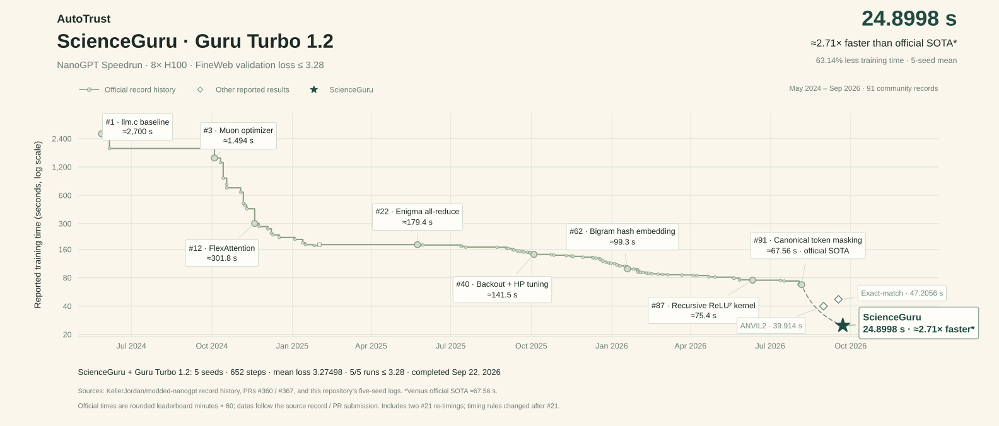
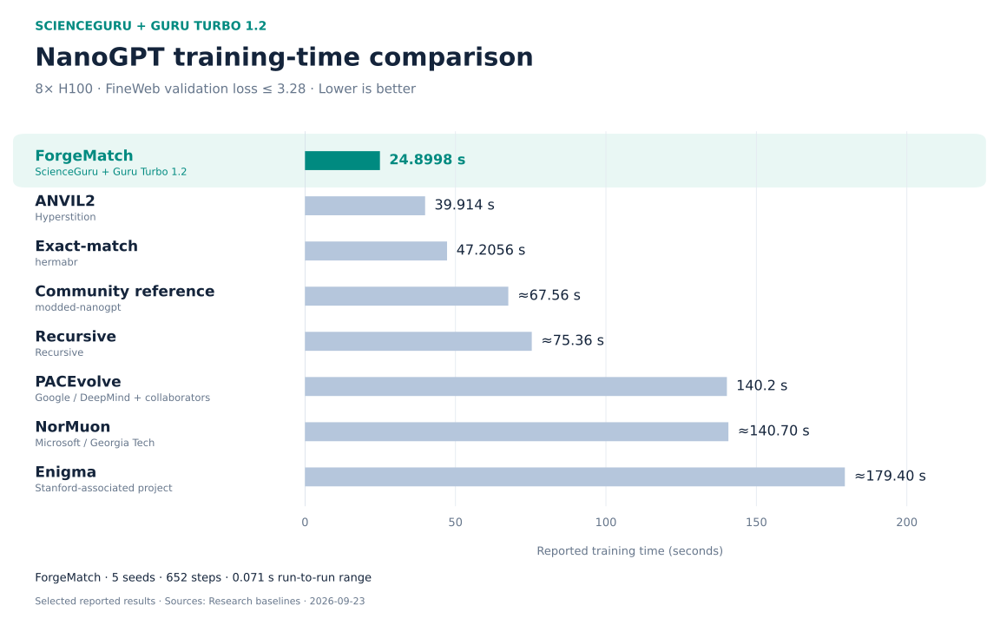

# ScienceGuru：NanoGPT 训练仅需 24.8998 秒，较官方 SOTA 加速约 2.71 倍

**AutoTrust 的 ScienceGuru 科研平台使用 Guru Turbo 1.2 模型，将 8×H100 上的 NanoGPT Speedrun 训练时间压至 25 秒以内。** 平均用时为 **24.8998 秒**，达到验证 loss ≤3.28 的质量目标。在相同质量门槛下，相较官方 SOTA 的约 67.56 秒，**耗时降低约 63.14%，节省约 42.66 秒**。[成绩与对比来源](docs/BASELINES.md)。

| 平均训练时间 | 相较官方 SOTA 加速 | 训练耗时降低 |
|---:|---:|---:|
| **24.8998 秒** | **≈2.71×** | **≈63.14%** |

自 2024 年以来，这项基准已累积 **91 条官方历史纪录，另有两次重计时**。每一次新进展，都需要继续优化经过社区多年打磨的训练系统；下图将我们的成绩放在这一持续演进的历史中。

[图表数据与来源](docs/SPEEDRUN_CHART.md) · [完整历史 PNG](assets/speedrun-history.png) · [近一年放大版](assets/speedrun-history-recent.png)

[English](README.md) · [复现指南](docs/REPRODUCE.md) · [策略说明](docs/STRATEGY.md) · [证据说明](docs/EVIDENCE.md) · [研究 baseline](docs/BASELINES.md) · [领先团队背景](docs/TEAMS.md) · [基准规则](docs/COMPLIANCE.md)

## AutoTrust、ScienceGuru 与 Guru Turbo 1.2

### AutoTrust

[**AutoTrust**](https://autotrust.ai/about) 是一家位于新加坡的应用 AI 研究实验室，致力于开发服务科学研究的人工智能系统。研究方向涵盖科研智能体、长程任务、自我改进的编程智能体、开放式算法与 AI 科学家。团队将真实科研工作中的任务轨迹用于改进模型训练、推理与智能体编排，让模型能力的发展与实际研究问题相互促进。

### ScienceGuru

[**ScienceGuru**](https://scienceguru.ai/) 是 AutoTrust 的科研工作空间，提供网页端与桌面端，将团队的模型能力融入文献阅读、科研推理和科学写作。它围绕连续的研究流程组织这些能力，帮助研究者从理解已有工作、分析研究问题，推进到整理和表达研究成果。本仓库将这一研究方向应用于语言模型训练效率优化，公开 NanoGPT 的具体训练策略、实验结果和复现材料。

### Guru Turbo 1.2

**Guru Turbo 1.2** 是本次 ScienceGuru 研究项目使用的模型。AutoTrust 的 [**Guru 模型系列**](https://autotrust.ai/models) 包括 Nano、Pro 与 Turbo，面向科研智能体与需要持续推进的研究任务，通过科研任务轨迹和合成科学数据改进能力。在本项目中，Guru Turbo 1.2 用于 NanoGPT 训练策略的研究与代码工作；基准计时对象是 [`model/`](model/) 中归档的小型语言模型的训练过程。

ScienceGuru 的训练方案结合训练语料的因果前缀检索、稀疏 n-gram embedding、FP8 计算和紧凑训练日程，并通过 CPU 绑核、异步预取与协调内存管理减少 GPU 等待和时间波动。

## 已核验成绩

由 **AutoTrust · ScienceGuru · Guru Turbo 1.2** 跑出的 652 步方案，平均训练用时 **24.8998 秒**，平均验证 loss 为 **3.27498**。结果在完整的 **10,485,760-token** 验证集上使用全词表概率计算。

成绩采用最终 validation 行的 `train_time`，计入训练、训练内容的读取、建库、查询与必要收尾。编译、预热和最终模型验证在该计时区间之外，详见[计时说明](docs/COMPLIANCE.md#timing-boundary)。

完整结果见[机器可读记录](results/cohorts.json)及[证据说明](docs/EVIDENCE.md)。

## 性能对比

核查日期：**2026-09-24 UTC**。以下比较 **8×H100、FineWeb loss≤3.28** 的训练耗时；标有 **≈** 的耗时由榜单中四舍五入的分钟数换算。加速比为各方案耗时除以 ScienceGuru 的平均耗时。

[下载对比图 PNG](assets/benchmark-comparison.png) · [对比数据与来源](docs/BASELINES.md)

| 策略 | 团队与机构 | 训练耗时 | ScienceGuru 加速比 |
|---|---|---:|---:|
| **[ScienceGuru，652 步](results/cohorts.json)** | **AutoTrust · Guru Turbo 1.2** | **24.8998 秒** | — |
| [ANVIL2](https://github.com/KellerJordan/modded-nanogpt/pull/360) | Hyperstition，原 Social Physics Lab | **39.914 秒** | **1.603×** |
| [Exact-match](https://github.com/hermabr/modded-nanogpt-public/blob/3e92b0e28293dcb184197da1a0ce1f543e84f76c/records/track_1_short/2026-09-16_ExactMatch/this_pr/statistics.md) | Herman Brunborg / Stanford 博士生 | **47.2056 秒** | **1.896×** |
| **[官方 SOTA · Canonical Token Masking](https://github.com/KellerJordan/modded-nanogpt/pull/350)** | Jan Varho / Fluentia | **≈67.56 秒** | **≈2.713×** |
| [ReLU² kernel 优化](https://github.com/KellerJordan/modded-nanogpt/pull/322) | Recursive | **≈75.36 秒** | **≈3.027×** |
| [PACEvolve](https://arxiv.org/pdf/2601.10657v3) | Google + Google DeepMind、威斯康星大学麦迪逊分校、UC San Diego | **140.2 秒** | **5.631×** |
| [NorMuon](https://github.com/KellerJordan/modded-nanogpt/pull/144) | Georgia Tech + Microsoft | **≈140.70 秒** | **≈5.651×** |
| [梯度 all-reduce 优化](https://github.com/KellerJordan/modded-nanogpt#world-record-history) | Stanford 关联的 Enigma 项目 | **≈179.40 秒** | **≈7.205×** |

相较官方 SOTA，ScienceGuru **耗时降低约 63.14%，加速约 2.713 倍，节省约 42.66 秒**。该纪录在[官方 Track 1 榜单](https://github.com/KellerJordan/modded-nanogpt#world-record-history)中的成绩为 1.126 分钟，对应 [PR #350](https://github.com/KellerJordan/modded-nanogpt/pull/350)。

同机复现详见[策略比较](docs/STRATEGY.md#comparisons)；机构关联、实验配置及 OpenAI/Anthropic 模型的优化器赛道结果详见 [baseline 文档](docs/BASELINES.md)。

## 领先贡献者的背景

| 贡献者 | 公开背景 | 本次对比中的成绩 |
|---|---|---|
| **Jan Varho · Canonical Token Masking** | [个人网站](https://jan.varho.org/)介绍其为 Fluentia 软件开发者。 | **≈67.56 秒** |
| **Hyperstition · Deven Pietrzak** | [ANVIL2 项目说明](https://github.com/KellerJordan/modded-nanogpt/pull/360)自述其背景为“MIT Math”；Hyperstition 前身为 Social Physics Lab。 | **39.914 秒** |
| **Herman Brunborg · Exact-match** | [GitHub 主页](https://github.com/hermabr)介绍其为 Stanford 博士生。 | **47.2056 秒** |
| **Recursive · Cong Lu** | [个人网站](https://www.conglu.co.uk/)介绍其为 Recursive 创始团队成员，曾任 Google DeepMind 研究科学家。 | **≈75.36 秒** |

各团队的技术方法、原始来源与比较范围见[领先团队背景](docs/TEAMS.md)；本实现继承的代码与方法见[来源署名与致谢](CREDITS.md)。

## 重要程度与考察内容

**它在小型语言模型训练效率、GPU 系统优化和自动化研究评估中具有较高参考价值。** 任务开放、质量目标固定，改动可追溯到源码和日志，适合反复验证优化思路。Google/DeepMind 的 PACEvolve、METR 和 Prime Intellect 都将它用于研究评估。Muon 系列展示了部分优化思想向更大模型迁移的价值。[相关研究](docs/BASELINES.md#benchmark-significance-and-scope)

| 考察维度 | 具体内容 |
|---|---|
| 收敛效率 | 优化器、学习率、初始化、训练日程，能否用更少更新达到指定 loss |
| 模型与目标设计 | 注意力、残差、embedding、辅助预测目标等设计 |
| GPU 与分布式效率 | BF16/FP8、Triton/CUDA kernel、算子融合、通信与计算重叠 |
| 数据与主机协作 | 数据加载、CPU 绑核、预取、内存分配、H2D 传输与 GPU 等待 |
| 实验与复现质量 | 多次运行、统计显著性、同机对照、计时边界、源码与日志可核查 |

主赛道以达到指定质量的训练时间计分；优化器赛道以固定模型、数据和 batch size 下的训练步数计分。

## 核心策略

模型从训练前缀中检索候选后续 token，将匹配长度与候选 embedding 转化为可学习特征，在网络输入、中间层和输出处使用。652 步训练日程配合 FP8 计算和稀疏参数更新，在目标 loss 下缩短训练时间。CPU 绑核、延后至实际使用时的 CUDA 等待、各 rank 协调释放索引，以及普通 CPU 内存中的原始 shard，进一步减少主机与 GPU 的协作开销。实际 H2D 传输使用 pinned 小批次缓冲；查询先于当前 step 数据入库，完整验证与计时边界保持不变。详见[策略说明](docs/STRATEGY.md)。

参考环境为 **8×H100 80GB HBM3、双路 Xeon Platinum 8481C、约 1.8 TiB 主机内存**。完整检索使用 **103 个训练 shard**，另需一个验证 shard。CPU 绑核针对该机器拓扑，迁移到其他机器前应按[复现指南](docs/REPRODUCE.md)核查。

[`model/`](model/) 保存 33 份逐字节一致的归档源码；[`provenance/source-files.json`](provenance/source-files.json) 记录其 SHA256。`model/README.md` 是继承的历史文档，运行本策略请以本仓库的[复现指南](docs/REPRODUCE.md)为准。

[来源署名与致谢](CREDITS.md) · [MIT 许可证](LICENSE)
